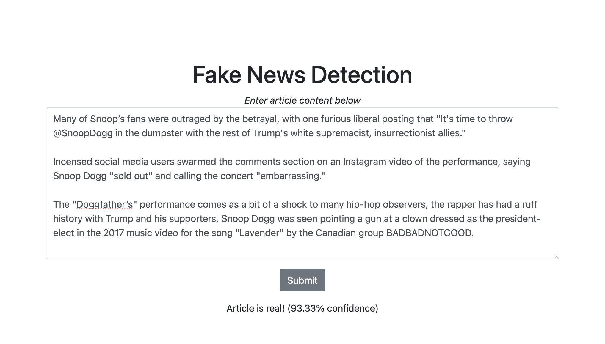

# Fake News Detection
### Shreeya Chand | sachand@usc.edu

#### Real-time fake news detection by a fine-tuned RoBERTa transformer model, deployed as a Flask app.

## Dataset
- [Fake News Detection Datasets by Emine Bozkus (Kaggle)](https://www.kaggle.com/datasets/emineyetm/fake-news-detection-datasets)
-  ~21k real news articles, ~23k fake
- Generally related to **world news/politics**
- **Preprocessing** ([EDA.ipynb](EDA.ipynb)): Most real articles included a **dateline** at the beginning (e.g. BUCHAREST (Reuters)), which I chose to parse out of each because it is not really an indicator of an article's credibility and could be incorrectly interpreted by the model as such. I wanted the model to be able to generalize for articles outside the dataset, and not just label every article with a dateline as true.


Word cloud visualizations of the true and fake article corpus, respectively.

## Model Development & Training
- **Model:** RoBERTa (A Robustly Optimized BERT Pretraining Approach) — refined version of BERT that performs better on many NLP tasks
- **Batch size:** 16 — balances memory efficiency and generalization
- **Maximum sequence length:** 512 — use as many tokens from each article as possible (many have more than 512 tokens)
- **Number of epochs**: 1 — see [Model Evaluation & Results](#model-evaluation--results)
- **Learning rate:** 2e-5 — recommended by authors
- **Scheduler:** linearly decays the learning rate over time, preventing overfitting
- **RobertaForSequenceClassification** class: linear layer on top of transformer architecture, needed for binary classifcation

## Model Evaluation & Results
- When initially trained for 4 epochs with a 90/10 training/validation split, the model's performance did not improve over the course of training, and testing showed that all text was being classified as real with a low softmax probability. This was also reflected by the validation accuracy during training, which aligned with the proportion of real articles in the combined dataset (48%).
- When trained with an 80/20 split, the model had 100% accuracy and ~0 loss within one epoch across training and validation data. This is excellent, but odd, and makes me think that the model has associated certain topics with fake news and others with real news (see [Dataset Limitations](#dataset-limitations)). Additionally, the learning rate could also be adjusted and potentially "warmed up". 
- **Loss function:** CrossEntropyLoss — measures difference between predicted probabilities of each class and true labels, penalizing incorrect predictions and "low-confidence" predictions more heavily
- To enable this model to be easily tested on new news articles, I deployed it in a web app interface using the Flask web framework. "Confidence" is given by the model's softmax probability for the predicted class. 




## Installation
```bash
git clone https://github.com/shreeyachand/fact-or-cap.git
cd fact-or-cap
python3 -m venv venv
source venv/bin/activate
pip install -r requirements.txt
flask run
```

## Discussion
- **Architecture:** A transformer model is well-suited to this task because unlike other NLP methods, its **attention mechanism** can capture complex relationships with tokens throughout a long news article, which is relevant to the task because fake articles may have certain grammatical structures, or repetition of words and ideas. RNNs and LSTMs on the other hand, are not effective for this task because they take in input sequentially, making it difficult to capture long-term dependencies and "remember" earlier tokens, especially when used on long articles.  
- **Token limit:** A major limitation of the model is that it can only take in 512 tokens as input at a time, and many articles in the dataset are longer. Remaining tokens after the first 512 are discarded, potentially leaving out important indicators of a fake article. Many fake articles included image credits at the end, but this pattern was likely not captured. Solutions may include taking a random subsequence of the article to predict on or averaging predictions from multiple sequences. 
- **Letter case:** While many transformer applications use "uncased" model variants, this model is case-sensitive (cased), meaning that different capitalizations of the same word are tokenized differently. This is intentional because the syntax of an article is a potential indicator of its credibility.
### Dataset Limitations:
- The fake news articles in this dataset are pretty discernible, because they contain obvious features like highly **opinionated language and profanity**. Bad actors may disguise fake news articles better, so a **more diverse dataset**, including less obvious examples, is needed in order to improve real-world perfomance. 
- The dataset contains articles from a very **limited time frame** (2016-2017) and could be overfit to the world events at that time and unable to make accurate predictions for events before or after that time frame. Additionally, the fake news dataset contains a few more "genres" of news than the true news dataset (Middle-east, left-news, etc.), which could lead the model to **associate those topics with fake news** and classify real articles on those topics as fake.
- Misinformation and disinformation is **more nuanced** than an article's title and content, and credibility is not necessarily binary. Dissemination of fake news often involves coordinated campaigns across social media networks and **additional features** like the author, website, and time posted could give a lot more insight into whether news is real or fake. 

Future work may include adding additional fake/real article datasets to add greater diversity of topic and structure. Additionally, generative models could be used to create synthetic data for the model to learn from, especially as large numbers of fake articles may be hard to find. 

## Sources
- [RoBERTa - HuggingFace](https://huggingface.co/docs/transformers/model_doc/roberta)
- [RoBERTa: A Robustly Optimized BERT Pretraining Approach](https://arxiv.org/pdf/1907.11692)
- [Fine Tuning Roberta for Sentiment Analysis](https://colab.research.google.com/github/DhavalTaunk08/NLP_scripts/blob/master/sentiment_analysis_using_roberta.ipynb)
- [L4/L5 Solutions](https://colab.research.google.com/drive/1NrVDXktmixZuHIILBUujVp9nCwwGsPu8)